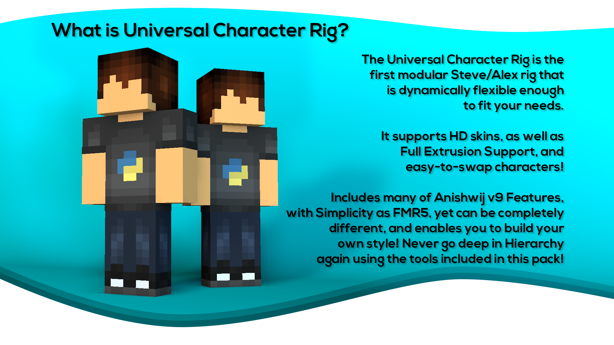

<h1 align = center>Setting up the Importer</h1>

Importer Wizard can be used to import any character at any location of the scene. The character root will also follow the importer's position and rotation.

Character Name
  > It is the character name you can assign to a character model before importing. It will reflect to the Bone, Mesh, Cape, Face, and Object Binder names.

Skin Path
  > It is the file path of your skin. In the importer model, the left side will be colored Green if it is acceptable, or the default will be used.

SSS / Subsurface Scattering File Path (Only in UCR 2.2)
  > It is the file path for the mask used by Subsurface Scattering. Usually the same as the skin file but all non-skin parts are removed. [Click here](subsurface-scattering.md) to see the SubSurface Scattering Render Samples.
  

  
V3 Type (UCR 2.2) / V1 Type (UCR 1.3)
  > It is the type of face you want to use.
  > - Square Mouth and Rounded Square Mouth for UCR 2.2
  > - Male and Female Face Types for UCR 1.3 (Have oval and squared mouth modes via Q-Controls)
  
Character Type
  > Chooses whether the character will have a Steve 4px Arms or Alex 3px Arms
  
Mesh Type (UCR 2.2 - 3 Types / UCR 1.3 - 2 Types)
  > Chooses which type of mesh the character will have
  > - UCR 2.2 have Freesize Mesh (Unextrudable), High-Poly Mesh (64x64), and Extra High Poly Mesh (128x128)
  > - UCR 1.3 have LowPoly Mesh (Unextrudable, only used as placeholder character), and Normal Mesh (64x64)
  
Include Bones
  > This will dictate if you want to import the default bones for your character of choice. It can be disabled if you plan to bind your bones which has been pre-posed.
  
Cape Type
  > Chooses what cape you want to give your character.
  > - Regular Cape - the usual cape used in Minecraft
  > - Optifine Cape - the one sometimes being used on servers. Uses banner texture most of the time.

Importer Code
  > - Current Code is a copy-able code which you can use in other importers present on the scene, or save in your notes so that you just need to type the code in the New Code field that sets the value of each settings in the Importer (Excluding skin and SSS data).

Run
  > When all is valid, pressing this button will import your character. Otherwise it will do nothing. The arrow at the lower part of the importer shows which way the character body will be facing to, as well as the center of the floor pane of the importer is where the character object will positioned.
  
Select After Run
  > This setting indicates if what will be selected after the import finishes.
  >  -  None: Deselects everything on the scene after import.
  >  -  This Importer: Does not deselect the current importer.
  >  -  Generated Binder: Deselects the current importer and selects the generated character.
